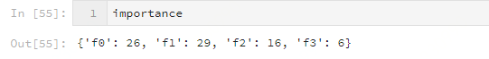
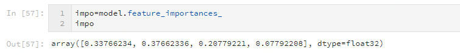

xgb包函数

<!-- more -->


# xgboost.sklearn.XGBClassifier

## f_score

```python
from xgboost.sklearn import XGBClassifier

model = XGBClassifier(**params)
model.fit(x_train, y_train, eval_set=watchlist,  # 训练模型
          eval_metric="logloss",
          early_stopping_rounds=30,
          verbose=True)
# feature importance 方法一
importance =model.get_booster().get_fscore()  #返回字典
```

结果（特征分叉次数）：



```python
impo=model.feature_importances_ #返回array
```

结果（特征分叉次数占比）：




#xgboost

```python
import xgboost as xgb
xgb_model = xgb.train (params, dtrain, num_boost_round, evals=watchlist, early_stopping_rounds=early_stopping_rounds, verbose_eval=True)

# feature importance
importance =xgb_model.get_fscore() #返回字典
```

结果：


