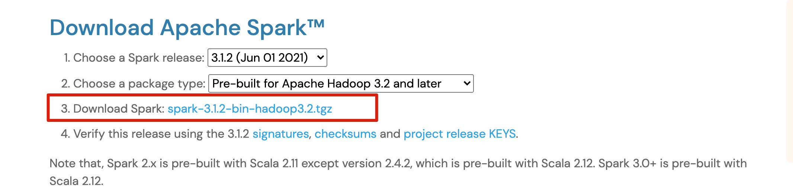
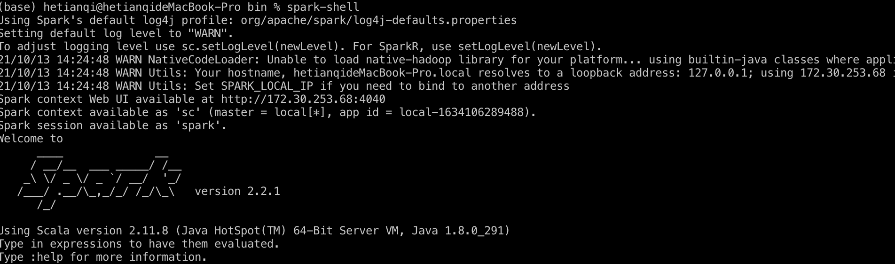

anaconda+tensorflow安装教程

<!-- more -->


[TOC]

# 安装pip,conda,tensorflow


1. 安装pip

   ```shell
   pip --version #check id exists
   
   sudo easy_install pip #安装pip
   ```

   pip --version错误：ImportError: No module named typing

2. 官网下载并安装anaconda,安装时勾选添加环境变量【非常重要，不然后续会出错】

   ```shell
   # anaconda path 如果忘记勾选了，要配置环境变量
   vim ~/.bash_proflw
   export PATH=$PATH:/Users/hetianqi/opt/anaconda3/bin/
   
   
   ```

   

3. cmd中确认conda安装正确

   ```bash
   conda -V
   ```

4. 创建新的虚拟环境

   ```bash
    #windows 的tensorflow只支持python3以上，3.6稳定，3.7和3.8都不稳定
   conda create -n python3.6 python=3.6 
   conda info -e
   conda env list
   conda activate python3.6  
   ```

5. 安装tensorflow

   https://mirrors.tuna.tsinghua.edu.cn/pypi/web/simple/tensorflow/ 清华镜像，可查询tensorflow版本

   ```bash
   # pip+清华镜像
   pip install -i https://pypi.tuna.tsinghua.edu.cn/simple tensorflow==2.0.0
   
   # pip+豆瓣镜像
   pip install -i https://pypi.douban.com/simple tensorflow==2.0.0
   
   # conda + 
   conda install --channel https://conda.anaconda.org/anaconda tensorflow=2.0.0
   
   pip install -i https://pypi.tuna.tsinghua.edu.cn/simple pandas
   ```


1. 在jupyterlab中使用tf

   ```shell
   source activate 环境 #激活环境
   conda install ipykernel
   conda install ipython
   conda install jupyterlab
   ipython kernelspec install-self ––user
   python -m ipykernel install --user --name 环境名称 --display-name “环境名称” 
   ```

   

2. 安装xgboost

   ```bash
   pip install -i https://pypi.tuna.tsinghua.edu.cn/simple XGBoost  #win10
   conda install py-xgboost #mac
   
   ```

3. 安装torch

   ```shell
   
   pip install torch===1.3.0 torchvision===0.4.1 -f https://download.pytorch.org/whl/torch_stable.html -i  https://pypi.mirrors.ustc.edu.cn/simple/
   ```

# 安装scala,pyspark

1. 安装brew

   在网上搜了很多brew安装方式，包括使用官网的方式都安装报错
   Failed to connect to raw.githubusercontent.com port 443: Connection refused

   可使用一下源

   ```
   /bin/zsh -c "$(curl -fsSL https://gitee.com/cunkai/HomebrewCN/raw/master/Homebrew.sh)"
   ```

2. 安装scala

   ```shell
   brew search scala #查看可安装版本
   brew instal scala@2.12
   # 修改~/.bash_profile
   export PATH="/usr/local/opt/scala@2.11/bin:$PATH
   scala -version #check是否安装成功
   ```

   报错： Error opening archive: Failed to open '/Users/hetianqi/Library/Caches/Homebrew/downloads/d1650a0762f1f057c43d5600d72a18d9aaa0c5da3cd172cac87ae9fcb6439bc0--openjdk-16.0.1.big_sur.bottle.tar.gz'

   解决方法：export HOMEBREW_BOTTLE_DOMAIN='' 

   详细解释参考 https://zhuanlan.zhihu.com/p/383707713

   > 如果scala交互模式下方向键乱码，则在~/.bash_profile中添加
   >
   > export TERM=xterm-color

3. 安装spark

   a) 下载安装包 http://spark.apache.org/downloads.html



​		b) 解压安装包，复制到路径 /usr/local/Cellar/

​		c) 修改~/.bash_profile

```shell
	
export SPARK_HOME=/usr/local/Cellar/spark/
export PATH=$SPARK_HOME:$SPARK_HOME/bin:$PATH
```

​		d) check是否安装成功

```shell
spark-shell
```




4. 安装pyspark

```shell
pip install pyspark
```

5. 配置idea for scala and spark

   Step1：建空maven项目

   Step2:  建scala目录并mark as source

   Step3: 下载scala插件：preference --> pluging -->scala

   Step4: 增加框架支持：右击工程--> add framework --> scala

   Step5: 添加apache jars: 右击工程 --> open module settings --> libraries --> + java --> browes --> /usr/local/Cellar/spark/jars  (finder看不见这个文件夹可以 commmand + shift + G)


