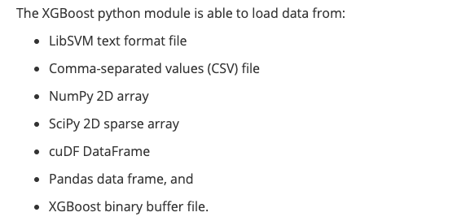

xgb模型的保存与调用

<!-- more -->


[TOC]

# 模型的保存与restore

常用的模型文件有dump, pickle,model三种格式，其中dump文件是可读文件，pickle和model文件是二进制文件。model文件是xgb官方支持的文件，适合所有版本，pickle文件使用第三方pickle包进行序列化。

xgb接口有xgboost.Booster()和xgboost.sklearn.XGBClassifier两个接口，xgboost.Booster()只能使用DMatrix形式数据进行训练，dmatrix数据可通过csv,txt,libsvm,dataframe得到，见https://xgboost.readthedocs.io/en/latest/python/python_intro.html

XGBClassifier可使用Grid Search 和并行处理



xgboost.sklearn.XGBClassifier可直接读dataframe数据

```python
# xgboost.Booster()版本模型restore和预测
import xgboost as xgb
dtrain = xgb.DMatrix(x,label=df['y_flag'],feature_names=df.columns[2:]) #x: dataframe;feature_names可指定特征名，取决于训练时是否有特征名
m1 = xgb.Booster(model_file='test.model') 
# 或者
m1 = xgb.Booster()
m1.load_model(f_model)
score = m1.predict(dtrain)

```

```python
# xgboost.sklearn.XGBClassifier版本restore和预测
m2 = XGBClassifier()
m2.load_model(f_model)  
a = m2.predict_proba(x)[:,1]
```

# 模型的训练与保存

```python
# XGBClassifier 版本
from xgboost.sklearn import XGBClassifier
import xgboost as xgb
import pickle
model=XGBClassifier(params) #params：dict,模型参数
watchlist=[(x_train, y_train), (x_test, y_test)]
model.fit(x,y, eval_set=watchlist)
#模型保存
model.get_booster().dump_model(f_model + '.dump') #可读文件
model.get_booster().save_model(f_model + '.model') #model二进制文件
pickle.dump(model, open(f_model + '.pickle.dat', "wb")) #pickl二进制文件
```

```python
# xgboost.Booster 版本
import xgboost as xgb
model = xgb.train(param, dtrain, num_round)  # dtrain是训练数据集
scores = bst.predict(dtrain)    

```

