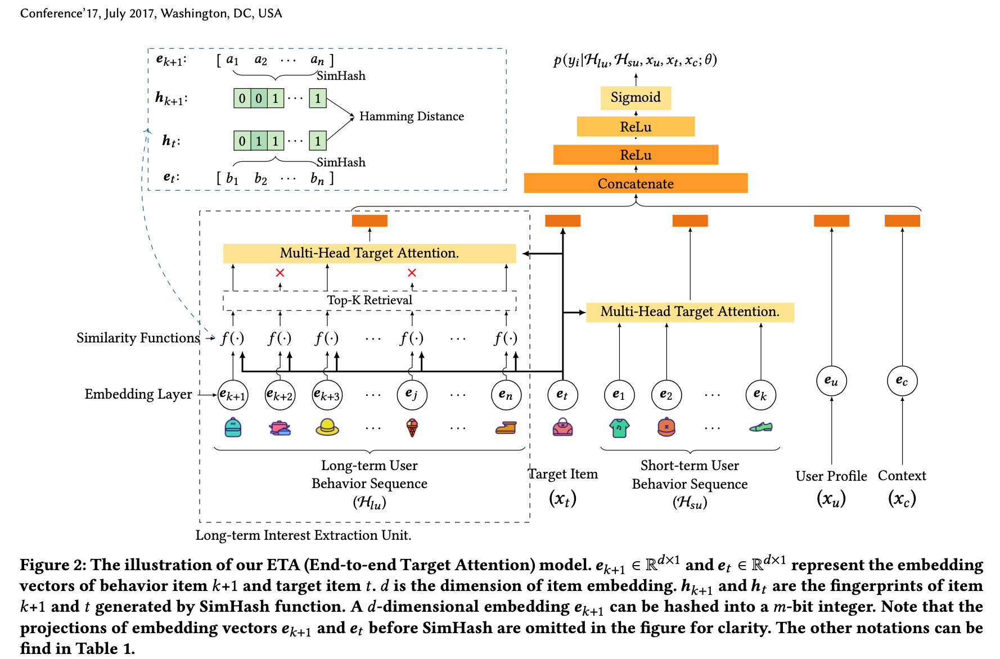
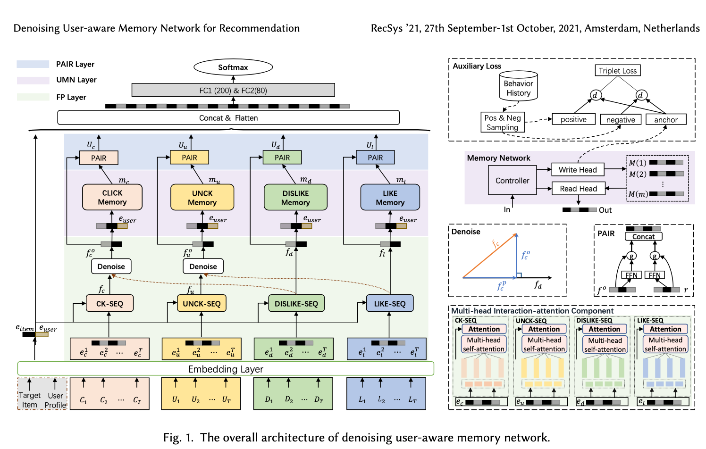

Awesome-Deep-Learning-Papers-for-Search-Recommendation-Advertising

<!-- more -->

---
title: Awesome-Deep-Learning-Papers-for-Search-Recommendation-Advertising
date: 2021-06-21 09:26:17
tags:
    - 深度学习
    - Attention
    - Transformer
    - 机器学习
    - 每日论文
    - 经典算法
    - NLP
mathjax: true
categories: 
    - 论文学习

---

Self-Attention谁先提出的，各文章里写的不一样，[Attention Is All You Need](https://papers.nips.cc/paper/2017/file/3f5ee243547dee91fbd053c1c4a845aa-Paper.pdf)中说是[Jakob.2016](https://arxiv.org/pdf/1606.01933.pdf)年提出的，[An Attentive Survey of Attention Models](https://arxiv.org/pdf/1904.02874.pdf)中说是[Yang et al. 2016](https://www.aclweb.org/anthology/N16-1174.pdf)，本篇介绍后者。

<!-- more -->

[TOC]

# Awesome-Deep-Learning-Papers-for-Search-Recommendation-Advertising
阅读等级：精，粗，to粗

## 0_New_Papers

## 1_Embedding

## 2_Maching

## 3_Ranking

### 【页面维度信息+负反馈】2022 (Alibaba) (WSDM)(ZhifangFan)[RACP]Modeling Users’ Contextualized Page-wise Feedback for Click-Through Rate Prediction in E-commerce Search

- 简介：建模用户的历史行为对个性化搜索和推荐都很重要，现有方法主要是对用户历史正反馈的建模（点击序列），忽略了产生反馈的上下文信息。本文通过加入历史**页面维度的曝光和反馈**做一位用户历史行为序列，提出了一种新的上下文感知的用户行为建模方式。通过捕捉页面内的信息和页面间的演化可以更详细的学习用户的偏好。 RACP(Recurrent Attention over Contextualized Page sequence)模型通过**page-context aware attention** 学习页面内的关系。**recurrent attention**学习页面间的关系
- 模型结构：

- quote
  - "However, they treat users’ positive and negative feedback separately, and rep- resent users’ feedback as a clicked item sequence and a non-clicked item sequence, which cannot generate the mutual context between clicks and non-clicks and ignores other page context information in the page-sequence" 历史工作很少考虑负反馈，即便考虑也是和正反馈分开处理的，这忽略了**正负反馈之间的相互作用**
  - 页面信息的增益：1）**正反馈是有噪音的**，避免过拟合。一个用户点了一个品牌不一定是他就偏好这个品牌，有可能是整个页面都是这个品牌 2) 用户对item的行为受曝光的其他item影响
  - 页面间的增益：搜索场景下用户的行为和意图是一个逐渐收敛的过程。例如：搜索---曝光---点击---搜索---曝光---点击---购买
  - "Recently, some pioneering work (**DFN** [33], **DSTN** [25]) high- light the importance of modeling both users’ positive and negative feedback for CTR prediction." 一些负反馈的工作
  - item画像：item id,品类id,shop id,统计类（成单量等）
  - query画像：query id,字符串，分词，类别
  - **页内的attention聚合+页间兴趣回溯(GRU，由下一个page表征当前的query) + 页间兴趣融合(attention)**

### 【长期行为+SimHash相似度】2021(Alibaba)(ArXiv)[ETA]End-to-End User Behavior Retrieval in Click-Through Rate Prediction Model

- 简介：用户的长期行为对CTR预估很重要，但由于性能的约束，超长期用户行为通常是通过两段式训练进行处理的。第一阶段通过长期行为召回topK,第二阶段结合短期行为进行排序。两阶段由于优化目标不一致降低了长期用户行为带来的CTR增益。本文通过**locality- sensitive hashing (LSH)**方法提出端到端的ETA模型，使得满足训练和推理性能要求的前提下端到端训练的长期用户行为ctr模型。主要是通过**SimHash**的方法计算相似度，使得相似度的计算复杂度由O(L* B * d)变为O(L*B)，其中L是序列长度，B是candidate梳理，d是embedding维度

- 模型结构：

  

### 2021 (Alibaba) (CIKM) [ZEUS] Self-Supervised Learning on Users’ Spontaneous Behaviors for Multi-Scenario Ranking in E-commerce

### 2020 (JD) (WSDM) [HUP] Hierarchical User Profiling for E-commerce Recommender Systems

### 【加入负反馈+显反馈对隐反馈去噪】2021(Alibaba)(ACM)[DUMN]Denoising User-aware Memory Network for Recommendation

- 简介：最近推荐领域非常多的工作聚焦在用户行为建模。用户的反馈包含显式和隐式的，大部分工作忽略了**隐式反馈的噪音**（用显示反馈对隐式反馈进行去噪），这会导致对于用户兴趣的有偏理解，本文1）通过正交映射( orthogonal mapping)对隐反馈进行去噪  2)基于内存的用户长期行为建模  3)短期行为和长期行为的融合。输入包括4个部分，**显示反馈：喜欢，不喜欢 ；隐式反馈：点击，未点击**
- 外卖场景下的显示隐式反馈是什么？？？

## 4_Post_Ranking

## 5_Multi-task

## 6_Graph_Neural_Network

## 7_Transfer_Learning

## 8_Reignforcement_Learning

## 9_Self_Supervised_Learning

## 10_Corporation

## 参考资料

参考github awosome paper repository: [Awesome-Deep-Learning-Papers-for-Search-Recommendation-Advertising](https://github.com/guyulongcs/Awesome-Deep-Learning-Papers-for-Search-Recommendation-Advertising)

