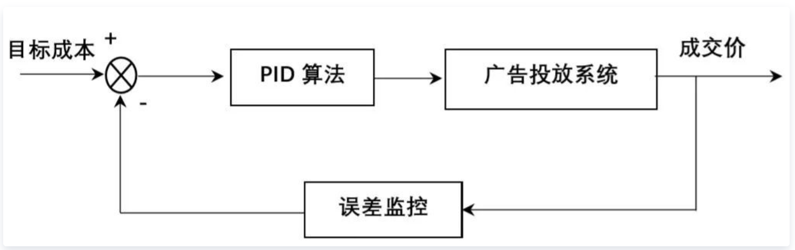
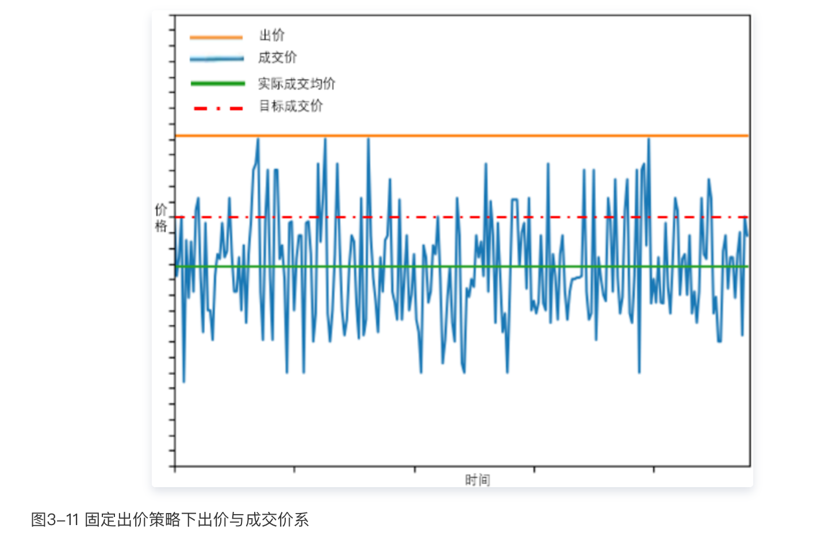
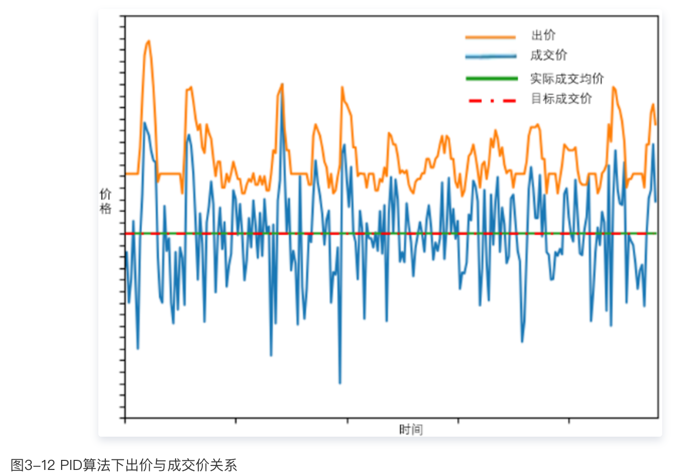

计算广告

<!-- more -->

[TOC]

# 1. 好文

https://borgwang.github.io/adtech/2020/12/09/adtech-buying-type.html 

# 2. 出价模式

转化链路：曝光 M -> 点击 C -> 转化 A -> 消费 P

 考核出价 ： bidROI

- 本质上 CPM 到 CPC 的变化是计费点和出价点从 M 移动到 C，这个点之前的部分（ CTR 预估）让渡给平台去完成了，广告主只负责这个点后面的预估
- 因为 CPA 模式按照转化计费，只要广告主不回传或只回传部分转化数据，就可以进行作弊，薅媒体平台羊毛。因此实际中 CPA 模式应用的很少。
- 从广告主的角度，从 CPM 到 CPC 到 CPA，出价点越来越靠近广告主考核点，平台需要预估的东西越来越多，承担的风险也越来越大。到了 CPA 这种模式，由于转化数据平台无法完全控制，**预估 CVR 带来的期望风险已经超过了期望收益了**，因此看上去很难再继续往链路后端发展。这时 Facebook 提出了 oCPX 模式，这种模式的创新点在于**分离了计费点和出价点**。我们仍希望利用媒体平台的能力对 CVR 进行预估，因此将出价点往后移到 A，因为这会带来平台收益；同时将计费点保留在 M 或者 C（对应 oCPM、oCPC），仍然按照曝光或点击计费，这会降低进行预估的期望风险（广告主没有动力作弊了）。

# 3. oCPX的成本控制

- oCPX 中的成本控制和预算控制
  - oCPX 是一种保转化成本的模式，即媒体平台需要在一个广告投放周期内对广告转化成本进行控制，使其尽量等于广告主设定的目标成本。因此 oCPX 中通常会有智能调价的功能，即如果前期出价出高了，比如广告主设定 80 元一个转化，前期投放下来发现一个转化要 100 元，这时候智能调价需要将出价调低，拉低其平均转化成本。最朴素的是做法就是用 PID 反馈控制出价
  - 除了成本控制之外也应该对预算进行控制，让预算在周期内以合理的节奏消耗，这个节奏通常与流量的分布差不多一致。

# 4. 计算广告中的PID成本控制

参考资料：

 [干货 | PID算法在广告成本控制领域的应用](https://cloud.tencent.com/developer/article/1745934 )

背景：

- 在实际的广告投放系统中，会包含诸如广告主端的点击率预估模型、用户价值预估模型、竞价算法，媒体端的OCPA、OCPC出价模型，以及多方竞价、二价成交等不可控机制，最终的投放系统十分复杂，影响投放成本的因素过多，造成**用户成交价与实际出价并不相等**，实际投放成本难以契合广告主在投放初期所制定的预算。
- 以信息流广告投放为例，广告主通过采买媒体平台广告位进行广告投放。在广告投放前，综合考虑投放目标以及历史投放经验等，会对广告投放预算成本进行控制，希望能够以预先规划的价格拿到广告位资源（即控制广告成交价）。但由于如前所述的广告投放系统中的出价优化模型以及二价成交机制等，**广告主往往不能直接控制成交价**，而需通过调整出价等方式间接控制成交价。
- 为了能够实现控制成交价的目的，我们实时监控成交价**（输出）**与预算成本**（目标）**间关系，并通过PID控制算法来动态调整出价**(输入)**

# 5. 其他

## CPX与OCPX的区别

CPX（如CPC,CPM等）是出价点与计费点一致，oCPX_a指的是计费点在X，出价点在a。相较与CPX，相当于媒体帮助广告主预估计费点到出价点的转化率，实现出价点成本控制下的动态竞价。

## eCPM 流量对于媒体的变现能力评估

eCPM的竞价模式下竞价点都是在**展示**,任何出价计费模式下eCPM的万能公式：

> eCPM =P(计费|展示) * bid_计费  * 1000   

例子：

eCPM = CTR * CPC * 1000  #点击出价，点击计费，即CPC模式

eCPM = CPM  # 展示出价，展示计费，即CPM模式

eCPM = CTR * P(授信|点击) *  bid_授信 * 1000  #授信出价，点击计费，即oCPC_a 

